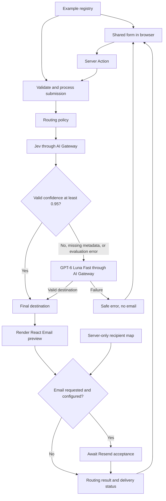

# Architecture

Jev x AI SDK Form Router is a single Next.js application demonstrating context-based routing for lead, contact, and issue submissions. Models select from application-defined destinations. Application code decides which model's answer to accept and whether to send an email.

See [README.md](README.md) for setup and [AGENTS.md](AGENTS.md) for contribution instructions.

## 1. Project structure

```text
app/
  layout.tsx                 Shared header, typography, metadata, and skip link
  page.tsx                   Redirects / to /leads
  [example]/page.tsx          Server-rendered page for all three examples
  actions.ts                 Shared submission Server Action
  globals.css                Theme and global styles
components/
  router-form.tsx            Form values, samples, submission, and pending state
  routing-result.tsx         Decision, statistics, disclosures, and email preview
  ui/                        Shared shadcn/Base UI components
lib/
  examples.ts                Fields, samples, destinations, criteria, and types
  router.ts                  Server validation and model selection policy
  submission.ts              Workflow orchestration, email rendering, and delivery
  recipients.ts              Typed, server-only destination-to-inbox map
  router.test.ts             Routing policy and validation tests
  submission.test.ts         Workflow, rendering, and delivery tests
  utils.ts                   Shared class-name utility
emails/
  routed-submission.tsx      Shared React Email template
.github/hooks/               Ultracite tool hook configuration
```

## 2. System and data flow



The registry supplies one choice per team/specialty combination. Both models receive the same validated submission, destination criteria, and routing instructions. The fallback receives no Jev answer or statistics.

## 3. Core components

| Component | Responsibility and boundary |
| --- | --- |
| App Router | `/leads`, `/contact`, and `/issues` share `app/[example]/page.tsx`. Unknown examples return 404. The page passes the public example definition and an email-configuration boolean to the form. |
| Form and results | `RouterForm` owns transient React state. Editing fields, loading samples, resetting, or changing email opt-in clears stale results. Submissions disable controls and preserve inputs on failure. Results display provenance, Jev statistics, timings, and sandboxed email HTML. |
| Example registry | `lib/examples.ts` provides form constraints, three editable samples per example, and ownership rules including overlap and triage guidance. Destination IDs and recipient-map keys derive from its literal definitions. |
| Routing policy | `lib/router.ts` derives Zod field validation, builds the shared model question, validates destination membership, and applies the confidence threshold. It imports `server-only`. |
| Submission workflow | `lib/submission.ts` validates the example ID, submission UUID, and form fields before invoking routing. The SDK resolves Gateway authentication. The workflow renders the email and optionally sends it. `app/actions.ts` is a thin entrypoint. |
| Email | One React Email template produces the preview and outgoing HTML. Delivery also includes plain text. `lib/recipients.ts` supplies inboxes and never enters the browser bundle. |

### Routing policy

Jev uses AI SDK's `experimental_evaluate` with `typesafe-ai/jev`. The app accepts a registered destination only when `providerMetadata.typesafe.confidence.destination` is a valid number from 0 to 1 and its unrounded value is at least `0.95`.

Low, missing, or invalid confidence, or a failed Jev evaluation, invokes `openai/gpt-6-luna-fast` through `generateText` and `Output.object`. Its schema allows only the current example's destinations. That answer becomes final even if it disagrees with Jev. There is no generated fallback confidence or further review loop.

Selected-option probability and confidence are separate statistics. Available Jev statistics describe Jev's original decision even when the fallback chooses another owner. Jev has a 12-second timeout and the fallback has a 25-second timeout, each with one SDK retry for retryable failures. Timings measure elapsed calls, including retries. A fallback failure returns a routing error and sends no email.

### Result and delivery contracts

`SubmissionResult` is a discriminated union: an error with a safe message and optional field errors, or success with the final decision, rendered email, and delivery status. Delivery is `preview`, `accepted`, or `failed`. A delivery failure preserves the successful routing result. Acceptance by Resend does not establish inbox delivery.

Delivery requires explicit opt-in, valid Resend credentials and sender, and valid inboxes for every destination on the current form. An opted-in request with incomplete configuration returns a successful routing result with failed delivery. The validated submitter address becomes `replyTo`.

Resend gets at most two sequential attempts for transient failures, using an identical payload and `form-router/<example>/<submissionId>` idempotency key. Each new form submission generates a new UUID. This protects retries within a send operation, not separate manual resubmissions.

## 4. Data and persistence

There is no application database, durable submission history, queue, or shared cache. Form values and results live in browser component state and are reset when the example component remounts. The server holds submission data for the duration of the request.

AI Gateway receives validated submission fields for routing. Opted-in email delivery sends the rendered submission to Resend. External services have their own retention behavior, so the absence of application storage does not imply that no external copy exists.

## 5. External integrations

| Integration | Use | Configuration |
| --- | --- | --- |
| Vercel AI Gateway via AI SDK | Jev evaluation and independent fallback decision | `AI_GATEWAY_API_KEY` or Vercel OIDC from request context in deployed Functions and `VERCEL_OIDC_TOKEN` locally |
| Resend SDK | Optional email delivery | `RESEND_API_KEY`, `RESEND_FROM`, and `lib/recipients.ts` |
| React Email | Local server-side HTML and plain-text rendering | Shared template, no email-service credentials needed for rendering |

The SDK resolves credentials when it makes a model call. Vercel Functions supply OIDC through request context, so missing environment variables do not establish an authentication failure. Actual authentication failures return a safe error, with local setup instructions only in development. Forms and sample loading remain available without credentials. Samples populate fields and always use live routing when submitted. Without email configuration, successful routing still includes a preview. Inbox addresses are code configuration, not environment variables or model output.

## 6. Runtime and infrastructure

The app uses Next.js 16, React 19, TypeScript, and the Node.js server runtime. The shared example page is explicitly dynamic and declares `maxDuration = 60` for hosts that support that setting. Server Actions require a server deployment rather than a static export.

Vercel is supported by the authentication and Marketplace setup documented in the README. There is no checked-in deployment pipeline, infrastructure provisioning, or application monitoring service. `.github/hooks/ultracite.json` configures a tool hook, not a GitHub Actions workflow. Model timings and returned Resend message IDs provide request-level diagnostics.

## 7. Trust and security boundaries

- Form data is untrusted. The server validates IDs, required fields, lengths, and email syntax and selects only registered fields before invoking models.
- Submission text is supplied as evidence, with instructions against overriding routing rules. Output validation restricts destination membership but does not guarantee semantic correctness.
- Provider credentials and recipient addresses stay in server-only modules. The browser receives configuration availability, not inboxes or secrets. Provider error internals are converted to safe messages.
- React Email escapes submitted text. The browser renders previews in an iframe with an empty `sandbox` and `no-referrer` policy.
- The template has no user authentication, application rate limiter, or durable deduplication. Routing assigns ownership and does not authorize the requested business action.

## 8. Development and verification

Use Node.js 22+ and pnpm. [Getting started](README.md#getting-started) covers cloning, dependencies, credentials, and local development. The experimental AI SDK dependency is pinned in `package.json`.

Vitest tests live beside the server modules. Routing tests inject AI SDK evaluation and language-model mocks. Workflow tests inject routing and recipient configuration and mock Resend and the `server-only` marker. Authentication tests exercise the real Gateway provider with mocked HTTP responses and a synthetic Vercel request context, covering API keys, local OIDC, and deployed OIDC through both models. Tests also cover confidence boundaries, independent fallback behavior, validation, email escaping, recipient selection, and delivery retries without external calls. Mock decisions verify application policy, not real model classification accuracy.

Ultracite configures Oxfmt and Oxlint, including Next.js, React, and shadcn rules. `pnpm validate` runs formatting/lint checks, TypeScript, Knip, and tests. `pnpm build` checks the production bundle. Browser accessibility and layout checks are manual, with no checked-in browser test suite.

## 9. Extension points and current limits

Change fields, samples, and criteria in the registry. Adding a destination also requires an entry in the typed recipient map. Adding an example requires updating `ExampleId`, the registry, the server's example-ID validation, and navigation order.

Keep the current workflow synchronous unless a task explicitly needs background jobs or persistence. Authentication, abuse controls, durable delivery tracking, and model-quality evaluation would require additional design for a production service. These are extension considerations, not committed roadmap features.

## 10. Project identification

- Project: Jev x AI SDK Form Router
- Repository: [vercel-labs/jev-ai-sdk-form-router](https://github.com/vercel-labs/jev-ai-sdk-form-router)
- Last reviewed: 2026-09-21

## 11. Terms

| Term | Meaning here |
| --- | --- |
| Destination | One registered team/specialty pair identified by a stable string ID |
| Triage | A registered owner for unclear, unsupported, or insufficiently specified requests |
| Confidence | TypeSafe metadata used by the application's acceptance threshold |
| Selected probability | Jev's probability for its chosen destination, displayed separately from confidence |
| Fallback | An independent decision from `openai/gpt-6-luna-fast` |
| OIDC | OpenID Connect, used for Vercel-provided Gateway credentials |
